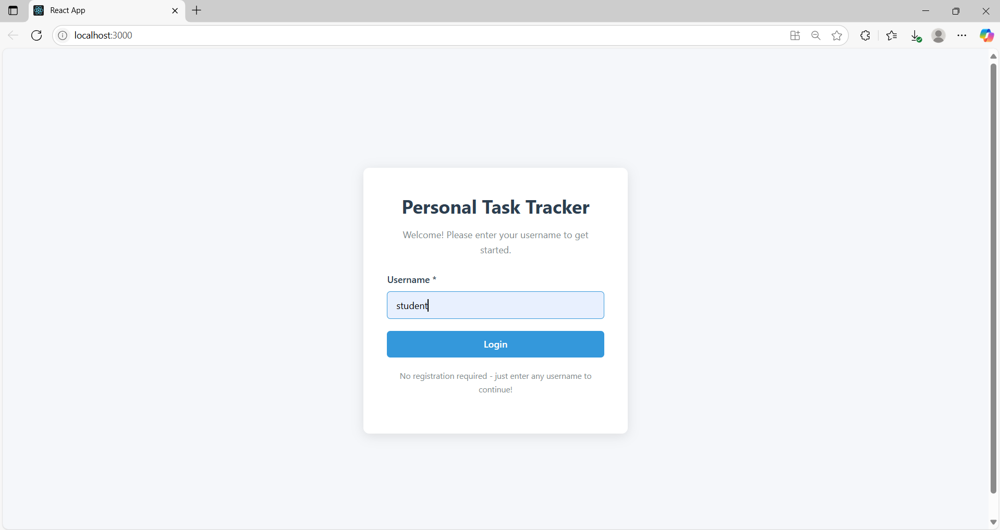
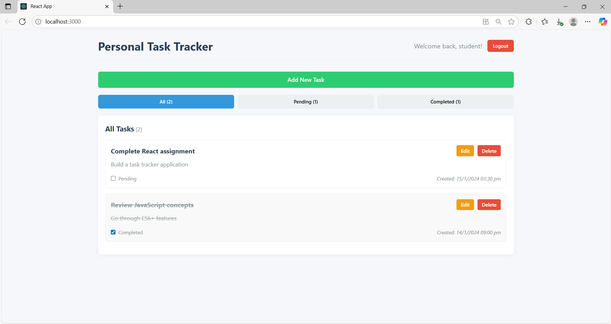
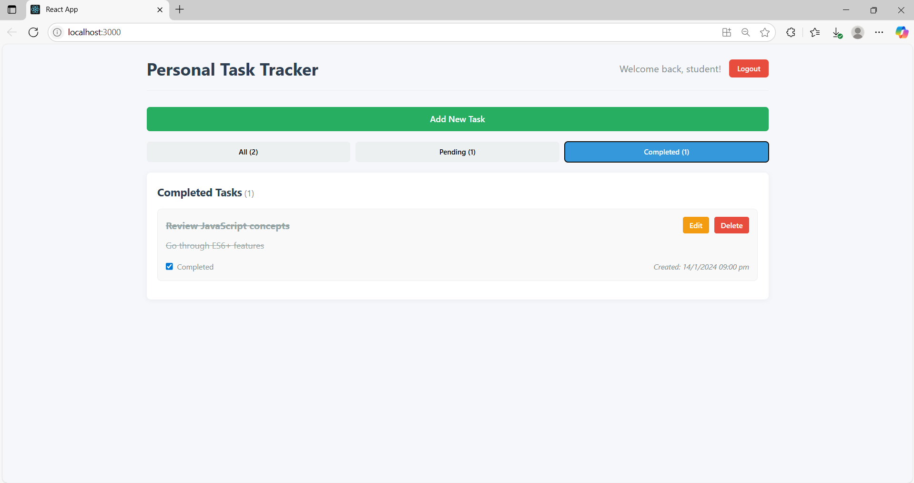

# Personal Task Tracker

## 📖 Description
A simple and intuitive personal task management application built with React. This application allows users to log in with a username, create, edit, delete, and track tasks with completion status. All tasks are persisted in the browser's local storage.

## 🚀 Features
- **Simple Login**: Enter any username to start using the app
- **Task Management**:
  - Add new tasks with title and description
  - Edit existing tasks inline
  - Delete tasks with confirmation prompt
  - Toggle task completion status
- **Task Organization**:
  - Filter tasks by: All, Pending, or Completed
  - Visual distinction between completed and pending tasks
  - Task counts for each category
- **Data Persistence**: Tasks saved in localStorage
- **Responsive Design**: Works on both mobile and desktop devices
- **Clean UI**: Intuitive interface with clear visual hierarchy

## 🛠 Setup Instructions
1. Clone the repository:
   ```bash
   git clone https://github.com/your-username/personal-task-tracker.git

2. Install dependencies:
   ```bash
   cd personal-task-tracker
   npm install

3. Start the development server:
   ```bash
   npm start

4. Open the application in your browser:
   http://localhost:3000

🧰 Technologies Used
- React.js (Functional components with hooks)

- JavaScript (ES6+)

- HTML5

- CSS3 (No external libraries)

- Git (Version control)

- Vercel (Deployment)

🔗 Live Demo
https://personaltasktracker.vercel.app/


## 🖼 Screenshots

## 🖼 Application Screenshots

<div align="center">
  
| Login Interface | Task Management | Completed Tasks |
|-----------------|-----------------|-----------------|
|  |  |  |

</div>
